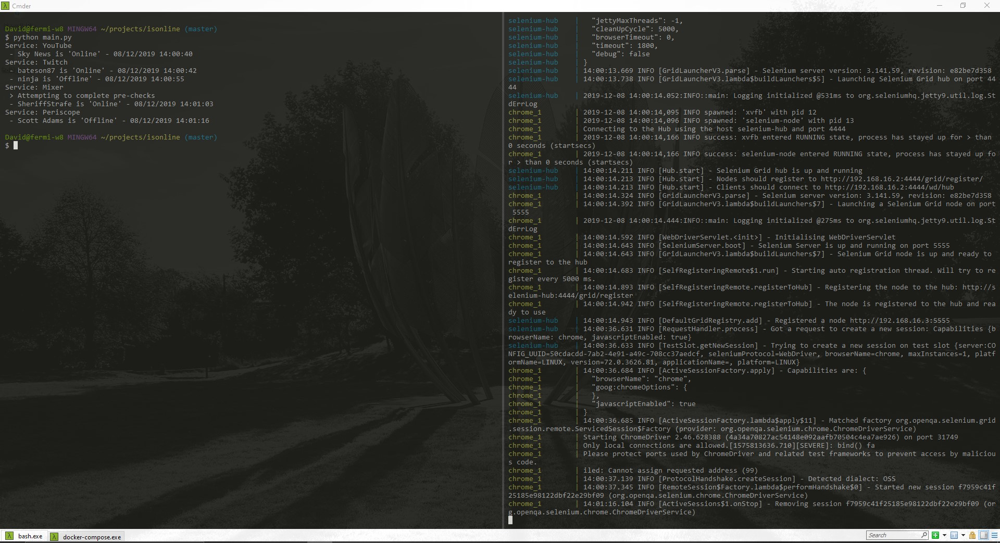

# IsOnline
IsOnline is a generic service status checker which can check if a configured service is online based on the criteria you specify

In this example you can see the output of the program. Checks are grouped by service and the service status is indicated next to each, including the date and time.

## Getting Started
- run `docker-compose up`
- Create a copy of `sample_services.json` and name it `services.json`.
- pipenv install
- pipenv shell
- execute `python main.py`
